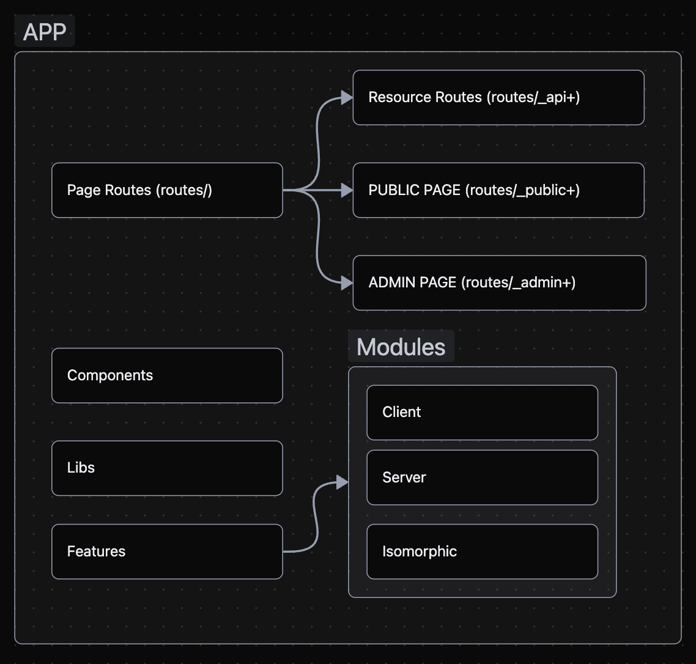
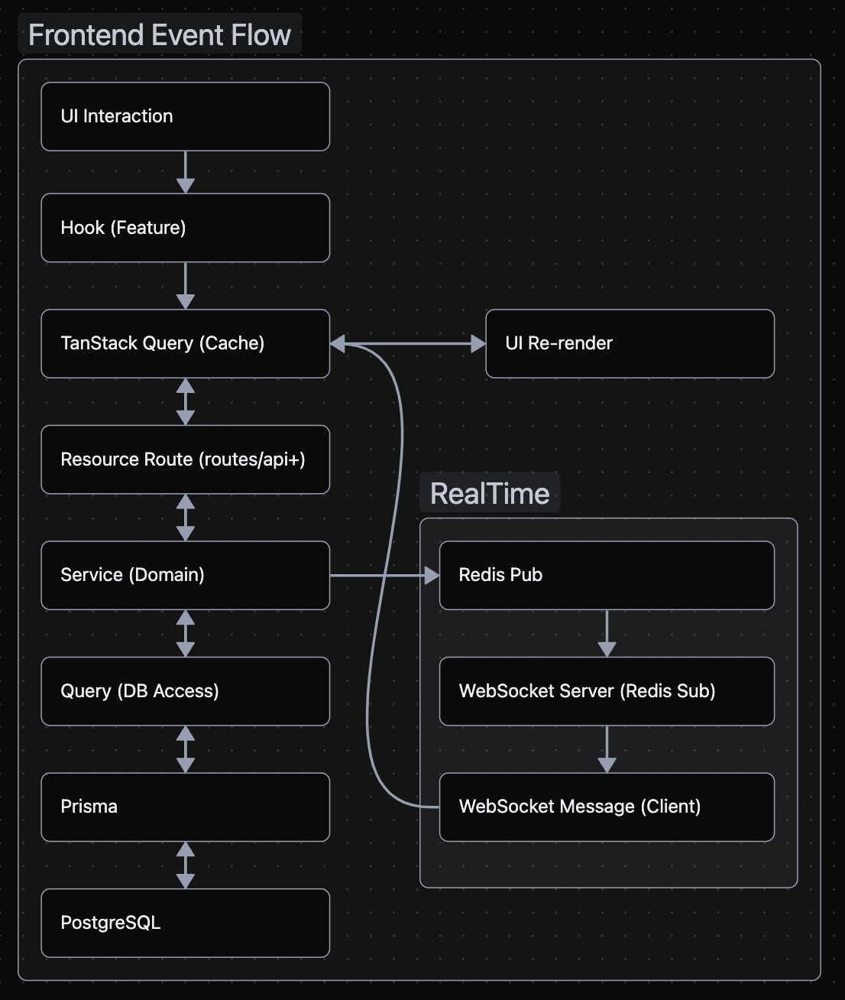
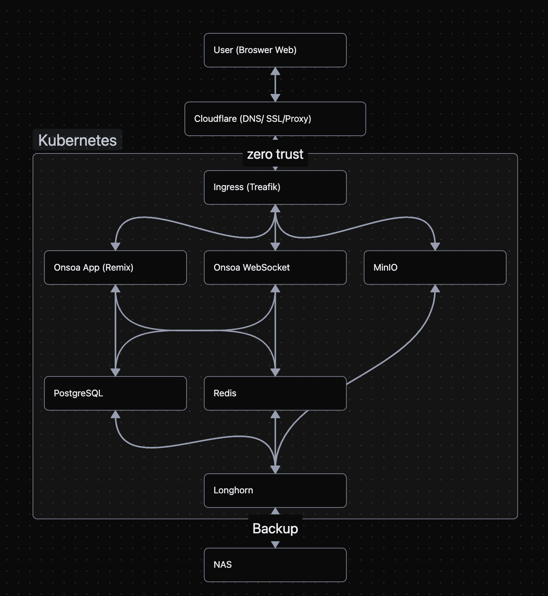
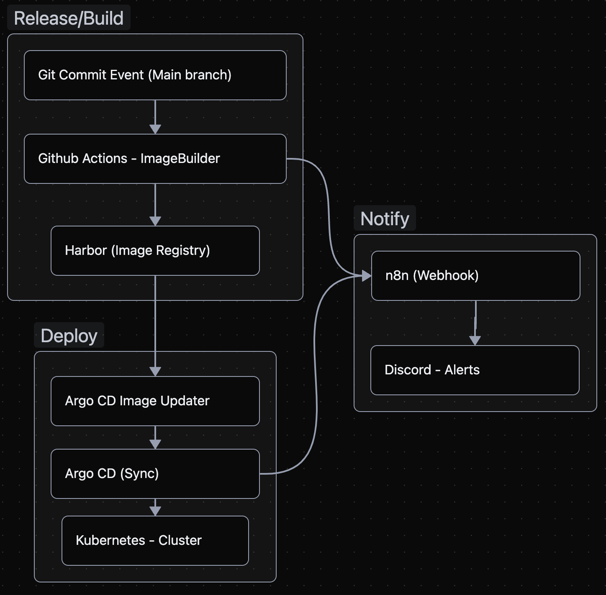

# ONSOA — Football Club Manager

> 동호회 축구 운영을 더 쉽게 만드는 플랫폼입니다.
> 클럽/매치 운영, 출석·기록 관리, 실시간 작전판(포지션 공유), 커뮤니티 소통까지 한 곳에서 해결합니다.

- Live: https://onsoa.net
- Portfolio (Notion): [Link](https://www.notion.so/Frontend-Engineer-React-Full-cycle-Builder-2d29462ba66880a3884cd65372621956?source=copy_link)
- Contact: nosicknnodie@gmail.com

이 레포는 포트폴리오/문서 공개용입니다.
운영 코드(실서비스 소스)는 보안 및 개인정보(실사용자/얼굴/기록 데이터) 이슈로 비공개(Private) 로 관리합니다.

## Problem

동호회 운영진/멤버가 매치 운영, 소통, 기록 관리를 여러 도구(채팅방/스프레드시트/메모 등)에 분산해 처리하면서 운영 부담이 커집니다.

## Target Users

- 1차 타깃: 운영진(감독/코치/총무) — 매치 운영 및 포지션 결정
- 2차 타깃: 팀원(선수) — 참여/기록 확인 및 커뮤니티 소통

## Impact / Scale (Current)

- 오픈 준비 및 파일럿 운영 중
- 등록 클럽: 1개
- 주간 사용자(대략): 약 40명
- 매치 운영 빈도: 주 1~2회
- 1인 개발 100% (설계–개발–배포–운영)
- 개발 기간: 약 1년+ (인프라 구축부터 병행)

## What I Built

- 클럽/멤버 관리
- 매치 생성/참여/상태 관리
- 출석 및 경기 기록(골/어시스트/평점 등)
- 실시간 작전판(포지션 공유/즉시 반영)
- 선수별 통계/랭킹(베스트11 등)
- 커뮤니티(게시글/댓글)
- 소셜 로그인

## My Role (End-to-End, Solo)

- 제품 기획/설계: 기능 정의, 화면 흐름, 권한 구조, 데이터 모델
- 프론트엔드: Remix 기반 UI, TanStack Query 기반 데이터/상태 관리
- 백엔드: Resource Route 기반 API, WebSocket 실시간 이벤트, 캐시/세션
- 인프라/운영: Kubernetes 배포, CD 자동화, 모니터링/알림 구성

## Tech Stack

- Frontend: Remix, TypeScript, Tailwind CSS, TanStack Query/Table, Lexical
- Backend: Prisma, PostgreSQL, Redis, WebSocket
- Infra: Kubernetes(K3s), Argo CD, GitHub Actions, Harbor, Grafana, MinIO, Cloudflare

## Architecture (Diagrams)

> 아래 다이어그램은 Notion 포트폴리오에 더 상세 버전이 있습니다.

- 
- 
- 
- 

## Deployment Pipeline (Summary)

- main 커밋 시 GitHub Actions에서 ARM64 이미지 빌드 → Harbor 푸시
- Harbor webhook + Argo CD Image Updater로 자동 배포
- 이벤트는 n8n webhook으로 수집해 Discord로 알림 전송

## Privacy Note

- 개인정보 보호를 위해 서비스 화면 캡처 및 실사용 데이터가 포함된 리소스는 공개하지 않습니다.
- 대신 기능/설계/운영 관점의 설명과 공개 가능한 범위의 문서로 구현 경험을 공유합니다.

## Next Goals

- MVP 오픈 및 운영 안정화(에러/로그/모니터링 강화)
- 사용자 피드백 기반 UX 개선 및 핵심 플로우 고도화
- 팀/클럽 확장에 대비한 권한/데이터 구조 확장

## Links

- Live: https://onsoa.net
- Portfolio (Notion): (여기에 너 Notion 링크 넣기)
- Contact: nosicknnodie@gmail.com

## Contributing

현재 개인 프로젝트로 운영 중입니다.
피드백/아이디어는 언제든 환영합니다.
